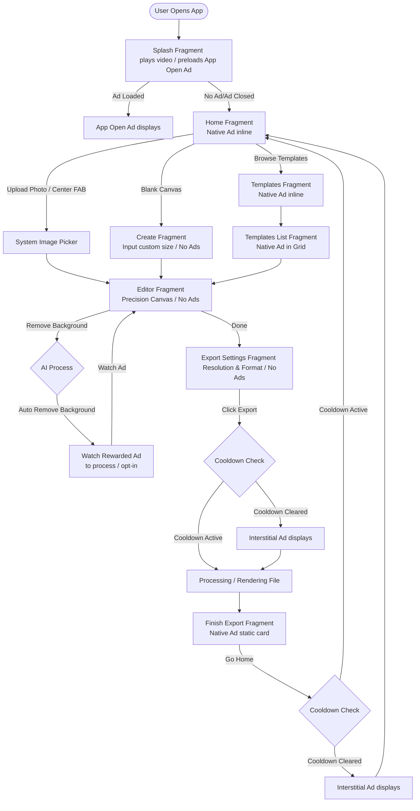

# AdMob Revenue Optimization & Policy Compliance Audit

This document details the monetization and compliance strategy for **UrduPhotoDesigner** (Urdu Canvas). It has been designed specifically for the app's current structural layout, navigation flows, and components.

---

## 1. Screen-by-Screen Monetization Report

### Splash Screen
* **Fragment & Layout:** [SplashFragment](file:///c:/Users/WebsCare/Documents/GitHub/UrduPhotoDesigner/app/src/main/java/com/webscare/urducanvas/ui/splash/SplashFragment.kt) | [fragment_splash.xml](file:///c:/Users/WebsCare/Documents/GitHub/UrduPhotoDesigner/app/src/main/res/layout/fragment_splash.xml)
* **User Intent:** The user is waiting for the app to initialize, enjoying the introductory brand video (`splash_video.mp4` running at `1.7x` speed).
* **Recommended Ad Type:** **App Open Ad** (Cold Start).
* **Exact Placement:** Full-screen overlay shown immediately after the splash video finishes or times out.
* **Trigger Timing:** Preloaded asynchronously during the video playback. If successfully loaded, show it the instant the video reaches completion (`setOnCompletionListener`). If the load fails or takes longer than the video (approx. `2.5 seconds`), immediately fall back and transition to the Home screen to avoid blocking the user.
* **Why This Placement Works:** High eCPM and fill rate. Since the user is in a passive "waiting" mode during startup, introducing a brief ad transition here yields excellent revenue without interrupting active workflows.
* **Policy Risk:** **Low Risk**.
  * *Mitigation:* Ensure a strict timeout (max 3 seconds) for the ad load. Never show the App Open ad if the splash screen has already dismissed and the user has begun interacting with the home screen.

---

### Home Screen
* **Fragment & Layout:** [HomeFragment](file:///c:/Users/WebsCare/Documents/GitHub/UrduPhotoDesigner/app/src/main/java/com/webscare/urducanvas/ui/navigation/home/HomeFragment.kt) | [fragment_home.xml](file:///c:/Users/WebsCare/Documents/GitHub/UrduPhotoDesigner/app/src/main/res/layout/fragment_home.xml)
* **User Intent:** Initiating photo edits, opening a blank canvas, searching templates/fonts, or browsing recent drafts.
* **Recommended Ad Type:** **Native Advanced Ad** (Medium/Large template).
* **Exact Placement:** Inline within the main content scroll view. Specifically, insert the Native Ad layout between the **Recent Projects** section (`recentsRV`) and the **Popular Templates** section (`popularTemplateRV`).
* **Trigger Timing:** Load on screen creation (`onCreateView`) and render as soon as the layout binds. Skip loading if the user is a Pro subscriber.
* **Why This Placement Works:** High user attention. This screen is the central hub. By using a native card format, the ad mimics a featured design asset card or template, resulting in high organic click-through rates (CTR) while remaining non-intrusive.
* **Policy Risk:** **Safe**.
  * *Mitigation:* Explicitly label the card with a clear "Ad" or "Sponsored" tag. Keep it well-separated from the active click targets like the center floating action button (FAB) or action cards (`Upload Photo`, `Blank Canvas`).

---

### Template Categories Screen
* **Fragment & Layout:** [TemplateCategoriesFragment](file:///c:/Users/WebsCare/Documents/GitHub/UrduPhotoDesigner/app/src/main/java/com/webscare/urducanvas/ui/navigation/templates/TemplateCategoriesFragment.kt) | [fragment_templates.xml](file:///c:/Users/WebsCare/Documents/GitHub/UrduPhotoDesigner/app/src/main/res/layout/fragment_templates.xml)
* **User Intent:** Browsing categorized templates (Islamic, Poetry, Festivals, etc.) and selecting preset sizes.
* **Recommended Ad Type:** **Native Advanced Ad** (Banner/Row template).
* **Exact Placement:** Injected directly into the vertical categories RecyclerView (`categoriesRV`) as an item at index 1 or 2.
* **Trigger Timing:** Loaded asynchronously upon entering the screen, binding to a custom adapter item type (`ITEM_TYPE_AD`).
* **Why This Placement Works:** Strong visual integration. It matches the list row style of template categories. As users scroll to find their category, they naturally view the ad row.
* **Policy Risk:** **Safe**.
  * *Mitigation:* Ensure the native ad item has a fixed container height and clearly distinct layout features (like a light gray border and "Ad" label) to prevent accidental clicks.

---

### Templates List Screen
* **Fragment & Layout:** [TemplatesListFragment](file:///c:/Users/WebsCare/Documents/GitHub/UrduPhotoDesigner/app/src/main/java/com/webscare/urducanvas/ui/navigation/templates/TemplatesListFragment.kt) | [fragment_templates_list.xml](file:///c:/Users/WebsCare/Documents/GitHub/UrduPhotoDesigner/app/src/main/res/layout/fragment_templates_list.xml)
* **User Intent:** Choosing a specific template to edit from a grid of designs.
* **Recommended Ad Type:** **Native Advanced Ad** (Grid Card template).
* **Exact Placement:** Rendered inside the staggered templates grid (`templatesRV`) every 6th or 8th template slot.
* **Trigger Timing:** Loaded alongside list pagination.
* **Why This Placement Works:** Blends seamlessly into the staggered feed. It feels like one of the templates, yielding higher user interaction and premium native eCPMs.
* **Policy Risk:** **Low Risk**.
  * *Mitigation:* Ad elements (headline, CTA button, media) must be styled in a card format that is easily distinguishable as sponsored content. Never overlay the ad label on top of template images.

---

### My Files Screen
* **Fragment & Layout:** [FilesFragment](file:///c:/Users/WebsCare/Documents/GitHub/UrduPhotoDesigner/app/src/main/java/com/webscare/urducanvas/ui/navigation/files/FilesFragment.kt) | [fragment_files.xml](file:///c:/Users/WebsCare/Documents/GitHub/UrduPhotoDesigner/app/src/main/res/layout/fragment_files.xml) (and lists in [FilesListFragment](file:///c:/Users/WebsCare/Documents/GitHub/UrduPhotoDesigner/app/src/main/java/com/webscare/urducanvas/ui/navigation/files/FilesListFragment.kt))
* **User Intent:** Accessing saved drafts to resume editing or delete files.
* **Recommended Ad Type:** **Native Advanced Ad** (Only when empty) / **No Ads** (when active).
* **Exact Placement:** Replaces the empty state view (`noEmojis` container) when the user has no saved files.
* **Trigger Timing:** Loaded only if the list size is evaluated as zero during item binding.
* **Why This Placement Works:** Monetizes otherwise dead space. If a user has no drafts, showing a clean native recommendation card populates the blank UI space elegantly.
* **Policy Risk:** **Safe**.

---

### Create Canvas Screen
* **Fragment & Layout:** [CreateFragment](file:///c:/Users/WebsCare/Documents/GitHub/UrduPhotoDesigner/app/src/main/java/com/webscare/urducanvas/ui/creation/CreateFragment.kt) | [fragment_create.xml](file:///c:/Users/WebsCare/Documents/GitHub/UrduPhotoDesigner/app/src/main/res/layout/fragment_create.xml)
* **User Intent:** Entering custom width/height values or selecting predefined canvas sizes.
* **Recommended Ad Type:** **No ads recommended.**
* **Why This Decision Was Made:** When entering custom dimensions, the soft keyboard covers a significant portion of the screen, pushing layouts dynamically. Placing a banner or native ad here would cause layout shifts, block essential text boxes, and invite policy flags for high accidental clicks.

---

### Editor Screen
* **Fragment & Layout:** [EditorFragment](file:///c:/Users/WebsCare/Documents/GitHub/UrduPhotoDesigner/app/src/main/java/com/webscare/urducanvas/ui/editor/EditorFragment.kt) | [fragment_editor.xml](file:///c:/Users/WebsCare/Documents/GitHub/UrduPhotoDesigner/app/src/main/res/layout/fragment_editor.xml)
* **User Intent:** Actively drafting and arranging text, layers, frames, colors, and graphics.
* **Recommended Ad Type:** **No ads recommended.**
* **Why This Decision Was Made:** This is a high-precision, intense user task. Users are dragging text elements near screen borders, interacting with active controls, and picking values. Adding an ad here reduces the canvas size, severely harms the editor UX, and poses an extreme policy risk of invalid accidental clicks.

---

### AI Background Removal Screen
* **Fragment & Layout:** [BgRemovalFragment](file:///c:/Users/WebsCare/Documents/GitHub/UrduPhotoDesigner/app/src/main/java/com/webscare/urducanvas/ui/editor/panels/removeBg/BgRemovalFragment.kt) | [fragment_bg_removal.xml](file:///c:/Users/WebsCare/Documents/GitHub/UrduPhotoDesigner/app/src/main/res/layout/fragment_bg_removal.xml)
* **User Intent:** Removing backgrounds from photos using manual brush actions or auto AI removal.
* **Recommended Ad Type:** **Rewarded Ad** / **Rewarded Interstitial Ad** (as a feature gate).
* **Exact Placement:** Triggered when the user clicks "Done" (`done` button) after finishing background removal or when selecting the "Auto Remove" AI feature.
* **Trigger Timing:** Show a prompt: *"Watch a short ad to export this background-removed photo for free, or unlock permanently with Urdu Canvas Pro."* Show the rewarded ad upon explicit confirmation.
* **Why This Placement Works:** High-value utility monetization. Background removal is a premium-tier feature. Users are highly motivated to watch a 15–30 second ad to obtain a clean background-cut image, driving maximum eCPM.
* **Policy Risk:** **Safe**.
  * *Mitigation:* The ad is strictly opt-in. There are no passive ads rendered on the brush canvas, eliminating brush-based accidental clicks.

---

### Export Settings Screen
* **Fragment & Layout:** [ExportFragment](file:///c:/Users/WebsCare/Documents/GitHub/UrduPhotoDesigner/app/src/main/java/com/webscare/urducanvas/ui/editor/export/ExportFragment.kt) | [fragment_export.xml](file:///c:/Users/WebsCare/Documents/GitHub/UrduPhotoDesigner/app/src/main/res/layout/fragment_export.xml)
* **User Intent:** Finalizing format settings (PNG vs. JPG), resolution, and quality indicators prior to export.
* **Recommended Ad Type:** **Interstitial Ad** (Triggered on click).
* **Exact Placement:** Triggered when the user clicks the final **Export** button (`btnExport`).
* **Trigger Timing:** Preload the interstitial in the background. On clicking `btnExport`, check if the cooldown (e.g., 3 minutes) has passed. If yes, show the interstitial before starting the file rendering progress bar.
* **Why This Placement Works:** A natural workflow transition. The user is leaving the editing interface and initiating a process that takes a few seconds (rendering progress bar), making it the perfect break to display an ad.
* **Policy Risk:** **Low Risk**.
  * *Mitigation:* Always show a short loading spinner or brief processing message before launching the interstitial to keep the transition smooth.

---

### Finish Export Screen
* **Fragment & Layout:** [FinishExportFragment](file:///c:/Users/WebsCare/Documents/GitHub/UrduPhotoDesigner/app/src/main/java/com/webscare/urducanvas/ui/editor/export/FinishExportFragment.kt) | [fragment_finish_export.xml](file:///c:/Users/WebsCare/Documents/GitHub/UrduPhotoDesigner/app/src/main/res/layout/fragment_finish_export.xml)
* **User Intent:** Sharing the final design, printing, or copying file path details.
* **Recommended Ad Type:** **Native Advanced Ad** (Medium Card).
* **Exact Placement:** Embedded as a static card within the scrolling list of results, specifically between the **File Details** card (`fileDetailsCard`) and the **Quick Actions** card (`quickActionsCard`).
* **Trigger Timing:** Load on screen bind.
* **Why This Placement Works:** High user dwell time. Users feel accomplished and spend several seconds looking at file specifications or deciding where to share, guaranteeing high ad viewability.
* **Policy Risk:** **Safe**.
  * *Mitigation:* Ensure layout margins separate the ad card from the action buttons (Open, Print, Share).

---

### Settings Screen
* **Fragment & Layout:** [SettingsFragment](file:///c:/Users/WebsCare/Documents/GitHub/UrduPhotoDesigner/app/src/main/java/com/webscare/urducanvas/ui/navigation/settings/SettingsFragment.kt) | [fragment_settings.xml](file:///c:/Users/WebsCare/Documents/GitHub/UrduPhotoDesigner/app/src/main/res/layout/fragment_settings.xml)
* **User Intent:** Accessing general settings, switching theme modes, rating the app, or contacting support.
* **Recommended Ad Type:** **Anchored Adaptive Banner** or **Collapsible Banner Ad**.
* **Exact Placement:** Anchored to the very bottom of the screen, sitting on top of the layout guidelines.
* **Trigger Timing:** Loaded on screen entrance.
* **Why This Placement Works:** Stable, non-interactive environment. Banners on settings pages provide a consistent baseline revenue without disrupting critical user tasks.
* **Policy Risk:** **Safe**.
  * *Mitigation:* Set appropriate bottom margins on the settings content scroll view (`settingsScroll`) so that the banner does not overlap the copyright text or version labels.

---

### Subscriptions Screen
* **Fragment & Layout:** [SubscriptionsFragment](file:///c:/Users/WebsCare/Documents/GitHub/UrduPhotoDesigner/app/src/main/java/com/webscare/urducanvas/ui/navigation/settings/subscriptions/SubscriptionsFragment.kt) | [fragment_subscriptions.xml](file:///c:/Users/WebsCare/Documents/GitHub/UrduPhotoDesigner/app/src/main/res/layout/fragment_subscriptions.xml)
* **User Intent:** Subscribing to premium features and evaluating payment options.
* **Recommended Ad Type:** **No ads recommended.**
* **Why This Decision Was Made:** Displaying ads on payment-related conversion screens dilutes user focus, reduces subscription conversion rates, and creates a cheap, cluttered app experience.

---

### Search Screen
* **Fragment & Layout:** [SearchFragment](file:///c:/Users/WebsCare/Documents/GitHub/UrduPhotoDesigner/app/src/main/java/com/webscare/urducanvas/ui/navigation/home/SearchFragment.kt) | [fragment_search.xml](file:///c:/Users/WebsCare/Documents/GitHub/UrduPhotoDesigner/app/src/main/res/layout/fragment_search.xml)
* **User Intent:** Searching for templates, assets, and local saved fonts.
* **Recommended Ad Type:** **Inline Adaptive Banner** (below list results).
* **Exact Placement:** Positioned at the bottom of the screen.
* **Trigger Timing:** Loaded when results render.
* **Policy Risk:** **Safe**.

---

## 2. Recommended Ad Format Strategies

### Interstitial Strategy
UrduPhotoDesigner will use Interstitial Ads only at natural breaks in flow, enforcing strict limits to maintain a premium user experience:

* **Trigger Events:**
  1. **Clicking Export:** In [ExportFragment](file:///c:/Users/WebsCare/Documents/GitHub/UrduPhotoDesigner/app/src/main/res/layout/fragment_export.xml) when the user confirms export settings (`btnExport`).
  2. **Leaving Success Page:** In [FinishExportFragment](file:///c:/Users/WebsCare/Documents/GitHub/UrduPhotoDesigner/app/src/main/res/layout/fragment_finish_export.xml) when clicking **Go Home** (`backToHome`).
* **Cooldown Rules:** A strict **3-minute minimum cooldown** must be enforced app-wide between interstitial displays using a shared preference timestamp check.
* **Session Limits:** Maximum of **4 interstitials** shown per user session.
* **When NOT to Show:**
  * Do not show when the user is navigating *back* (e.g. hitting back to return to the editor).
  * Do not show during editor work, canvas size setup, or when the soft keyboard is visible.
  * Disable all interstitial loading if the subscription flag `billingManager.isSubscribed.value` is true.

---

### Rewarded Strategy
Rewarded ads should offer clear value exchanges, turning monetization into a user benefit:

* **Optional Opportunities:**
  1. **Background Removal Tool:** Grant free access to the automated AI background removal feature for the current photo in exchange for watching 1 rewarded ad.
  2. **Premium Font Unlock:** Allow temporary 24-hour access to high-demand locked premium fonts (such as Jameel Noori Nastaliq or specific calligraphy sets) by watching 1 rewarded ad.
* **Fit and UX:** Must remain 100% optional, triggered only by clicking a clean "Watch Ad to Unlock" button overlay on premium assets. Never force-play a rewarded ad.

---

### Native Ads Strategy
Native ads must blend into UrduPhotoDesigner’s clean, modern UI while adhering to visual guidelines:

* **Design Integration:**
  * Custom layout XML matching the card styles in [layout_recents_item.xml](file:///c:/Users/WebsCare/Documents/GitHub/UrduPhotoDesigner/app/src/main/res/layout/layout_recents_item.xml) and [layout_template_item.xml](file:///c:/Users/WebsCare/Documents/GitHub/UrduPhotoDesigner/app/src/main/res/layout/layout_template_item.xml).
  * Maintain the identical corner radius (`12dp`), text sizes (`14sp` title, `12sp` body), and app colors (e.g. primary color branding on buttons).
* **Grid and Feed Integration:**
  * In the **Home feed** (`HomeFragment`), native ads render as custom styled cards.
  * In **Template Lists** (`TemplatesListFragment`), the native ad adapts to the Staggered Grid, filling one cell but with a distinct "Sponsored" badge.
* **Labeling:** Ensure a clear "Ad" or "Sponsored" tag is present in the top-right corner.

---

### Banner Strategy
Banners provide consistent baseline revenue:

* **Adaptive vs. Collapsible:**
  * Use **Anchored Adaptive Banners** at the bottom of the **Settings** (`SettingsFragment`) and **Preferences** (`PreferencesFragment`) screens. Banners should not be used on main tab screens (Home/Templates/Files) to prevent interference with the sliding/springy bottom navigation bar.
* **Avoidance:** Banners must be avoided on the **Editor Screen** and **Create Canvas Screen** to prevent accidental clicks.

---

### App Open Ads
* **Cold Starts:** Load the App Open ad during the splash video. Show it when the video completes *only if* the ad loaded successfully within `2.5 seconds`.
* **Resume Starts:** Trigger when the app is brought from the background to the foreground.
* **Exclusion List:** Do not trigger App Open Ads if the active screen is a subscription purchase panel or editor canvas.

---

## 3. Revenue Estimation

Below is a value ranking of the proposed ad placements based on expected fill rate, eCPM, and user engagement:

| Rank | Placement Screen | Ad Format | Expected eCPM | Revenue Tier | Justification |
| :--- | :--- | :--- | :--- | :--- | :--- |
| **1** | Background Removal | Rewarded Ad | **$12.00 - $25.00**| **High** | Opt-in features like AI extraction have high intent, leading to completed ad views. |
| **2** | Editor Export Trigger | Interstitial | **$8.00 - $18.00** | **High** | High eCPM transition point. Triggers when exporting, ensuring 100% viewability. |
| **3** | Home Feed (Inline) | Native Advanced | **$4.00 - $9.00** | **Medium** | Central feed placement with high impressions. |
| **4** | App Open (Cold Start) | App Open Ad | **$5.00 - $10.00** | **Medium** | Shows on app launch, capturing all active daily users. |
| **5** | Success Page | Native Advanced | **$3.50 - $7.00** | **Medium** | Users view file specs, giving the native card high dwell time. |
| **6** | Settings Screen (Bottom) | Collapsible Banner| **$1.50 - $4.00** | **Low** | Low page view frequency, but good banner baseline. |

---

## 4. Monetization Journey Map

---

## 5. Policy Compliance Audit

### Accidental Clicks (AdMob Policy)
* **Risk:** Ads placed too close to active buttons.
* **Findings:** The center floating action button (FAB) in the main navigation overlaps the home screen layout dynamically. 
* **Compliant Solution:** If native ads or banners are used on the Home screen, they must have a minimum safety margin of **24dp** from the bottom navigation view and FAB coordinates to prevent accidental taps during scrolling.

### Invalid Traffic / Navigation Interruptions (Google Play Policy)
* **Risk:** Interstitials displaying unexpectedly.
* **Findings:** Transitioning between editor sub-panels or triggering an interstitial instantly when a user presses the Android back button causes high user frustration and accidental clicks.
* **Compliant Solution:** Never trigger interstitials on back navigation. Only trigger on forward, explicit actions (like pressing "Export").

### Clear Ad Labeling (AdMob Policy)
* **Risk:** Native ads styled exactly like templates might mislead users.
* **Findings:** In the Staggered Grid of templates, native cards might be mistaken for free templates.
* **Compliant Solution:** The native ad container must have a distinct background color (e.g. light gray vs. white for templates) and include a prominent, non-obscured **"Sponsored"** or **"Ad"** tag with high contrast.

---

## 6. Audit Score

### Final Monetization Score: **8.5 / 10**

* **Justification:**
  * The application has clean user flows with clear, natural transition points (such as the successful file export landing page) that are ideal for high-revenue ad formats (Interstitials & Native Ads).
  * High-value utilities like **AI Background Removal** present a strong case for rewarded ads, providing monetization without degrading user satisfaction.
  * The editor workspace is kept completely ad-free, protecting the core user experience and minimizing policy compliance risks.
  * *Areas for Improvement:* Implementing a unified AdManager wrapper that respects both subscription states and strict interstitial cooldowns is critical before launching the ad systems.

---

## 7. Phased Implementation Roadmap

### Phase 1: Core Setup & App Open Ads (Highest Priority)
* **Tasks:**
  * Initialize the Google Mobile Ads SDK inside [MyApplication](file:///c:/Users/WebsCare/Documents/GitHub/UrduPhotoDesigner/app/src/main/java/com/webscare/urducanvas/MyApplication.kt) on a background thread.
  * Create `AdManager` wrapper class utilizing Hilt injection to track interstitial timestamps and subscription states.
  * Implement **App Open Ad** manager connected to the splash video completion callback.

### Phase 2: Interstitials & Native Ads (Medium Priority)
* **Tasks:**
  * Integrate the **Interstitial Ad** trigger on the "Export" button click inside [ExportFragment](file:///c:/Users/WebsCare/Documents/GitHub/UrduPhotoDesigner/app/src/main/java/com/webscare/urducanvas/ui/editor/export/ExportFragment.kt).
  * Create the XML layout templates for native ads matching Urdu Canvas's typography and margins.
  * Injects Native Ads in the **Home** feed and **Templates categories list** adapters.

### Phase 3: Rewarded Ads & Settings Banners (Lower Priority)
* **Tasks:**
  * Add the premium feature opt-in dialog to the AI **Background Removal** (`BgRemovalFragment`).
  * Implement the rewarded ad callback that updates the canvas state upon completion.
  * Anchor Adaptive Banners to the bottom layout of [fragment_settings.xml](file:///c:/Users/WebsCare/Documents/GitHub/UrduPhotoDesigner/app/src/main/res/layout/fragment_settings.xml) and [fragment_preferences.xml](file:///c:/Users/WebsCare/Documents/GitHub/UrduPhotoDesigner/app/src/main/res/layout/fragment_preferences.xml).
